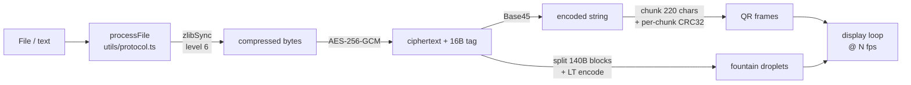
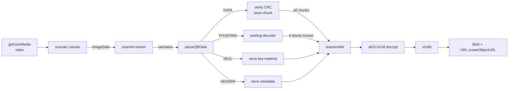
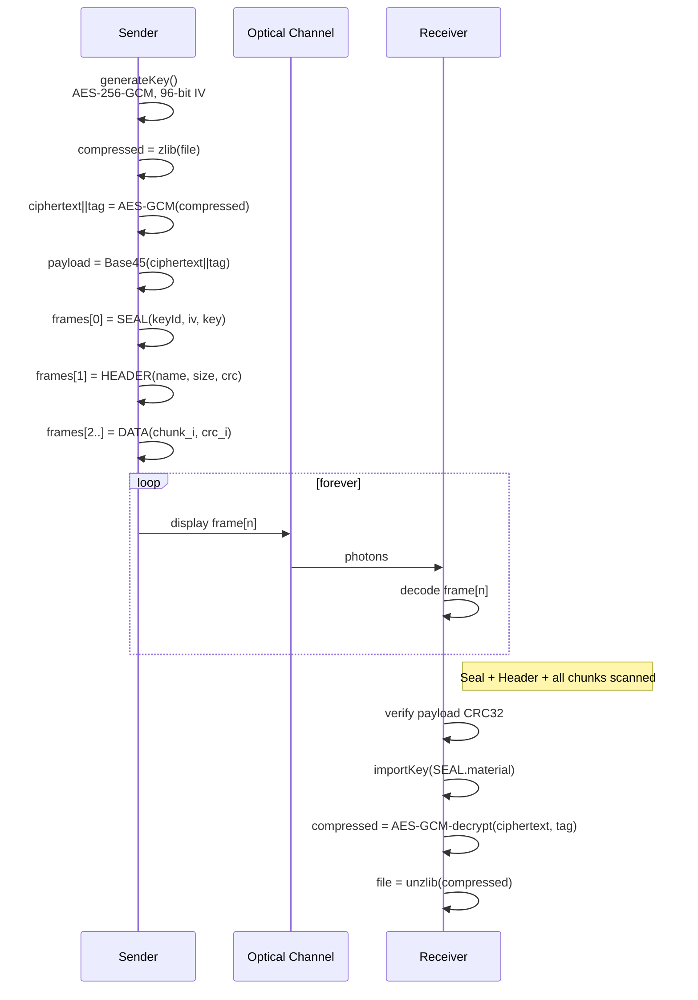
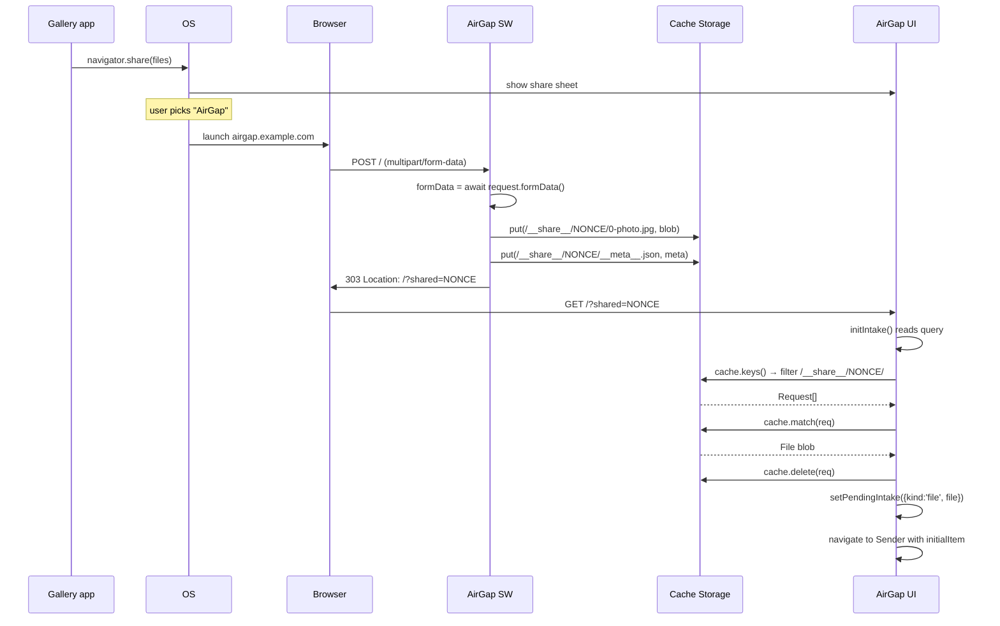
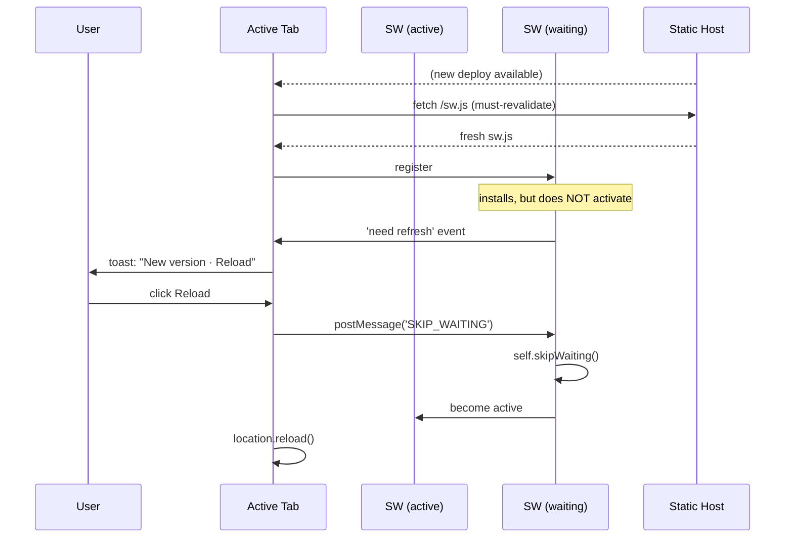

# AirGap v2 — Offline QR File Transfer

[](https://opensource.org/licenses/MIT)
[](https://www.typescriptlang.org/)
[](https://react.dev/)
[](#testing)

> An installable PWA that transfers files between two devices using only a
> camera and a screen — no network, no cables, no cloud. One device paints an
> animated stream of QR codes; the other device's camera captures them and
> rebuilds the file.

```
┌─────────────────────┐                              ┌─────────────────────┐
│     Device A        │                              │     Device B        │
│                     │                              │                     │
│    ░█▀█░█▀█░█▀█░    │                              │                     │
│    ░█▀█░█░█░█░█░    │  ─────── photons ─────▶      │  ▒▒▒ camera ▒▒▒     │
│    ░▀░▀░▀▀▀░▀░▀░    │                              │                     │
│                     │                              │                     │
│     [ Sender ]      │                              │    [ Receiver ]     │
└─────────────────────┘                              └─────────────────────┘

            ▲                                                     ▲
            └──────── NO NETWORK · NO CABLES · NO CLOUD ──────────┘
```

---

## Table of Contents

1. [What AirGap is](#what-airgap-is)
2. [Why AirGap exists](#why-airgap-exists)
3. [Quick start](#quick-start)
4. [Architecture overview](#architecture-overview)
5. [The wire protocol](#the-wire-protocol)
6. [Cryptography](#cryptography)
7. [Fountain coding (LT)](#fountain-coding-lt)
8. [Scanner pipeline](#scanner-pipeline)
9. [PWA surface](#pwa-surface)
10. [UI/UX architecture](#uiux-architecture)
11. [Bundle and code-splitting](#bundle-and-code-splitting)
12. [Security posture](#security-posture)
13. [File tree](#file-tree)
14. [Testing](#testing)
15. [Development](#development)
16. [Production deployment](#production-deployment)
17. [Limitations](#limitations)
18. [Design decision log](#design-decision-log)
19. [Roadmap](#roadmap)

---

## What AirGap is

AirGap is a browser-based PWA that moves files between two devices
optically — sender encodes the file as a stream of animated QR codes, receiver
scans them with a camera and reassembles the file locally. Everything runs in
the browser; there is no server, no peer-to-peer networking, and no cloud.

It's built for situations where a network is unavailable, untrusted, or
forbidden: air-gapped systems, cross-organization boundaries, travel without
shared Wi-Fi, quick transfers between devices on different VLANs.

**Core properties:**

- **Offline by design** — after the first load, the PWA precaches every asset
  (including the pdf.js worker) and runs fully offline.
- **End-to-end encrypted** — every transfer generates a fresh AES-256-GCM key;
  receivers that don't see the "Seal" frame cannot decode anything.
- **Self-healing** — fountain-code mode lets the receiver reconstruct from any
  sufficient *subset* of droplets. Drop as many frames as you want.
- **Dense** — zlib compression + Base45 encoding + QR alphanumeric mode gives
  ~29% more data per code than a naïve Base64 approach.
- **Native feel** — installable, safe-area aware, bottom-sheet modals, no
  rubber-band overscroll, hover-less touch interaction, reduced-motion
  respected.

---

## Why AirGap exists

QR-based file transfer sounds like a novelty, but it fills three real gaps:

| Scenario | Why traditional transfer fails |
|---|---|
| **Air-gapped networks** | No route between the two hosts by policy. |
| **Cross-organization** | Shared drive requires an account that one party can't get. |
| **Mobile-to-mobile with no common network** | Peer tethering, Nearby Share, AirDrop are platform-locked. |
| **Forensics & compliance** | Optical transfer leaves no network artifact to audit. |
| **Untrusted networks** | Even an E2E-encrypted channel betrays metadata (IP pair, timing, DNS). Optical reveals nothing. |

---

## Quick start

**Prerequisites:** Node 22.x, a modern browser with camera access
(Chrome/Edge/Safari/Firefox 135+).

```bash
git clone <this-repo>
cd "airgap v1"
npm install --legacy-peer-deps
npm run dev            # → http://localhost:3000
```

Open the URL on two devices (laptop + phone works great). Hit **Broadcast** on
one, **Capture** on the other, pick a file.

**Scripts:**

```bash
npm run dev            # dev server with HMR
npm run build          # production bundle + Service Worker
npm run preview        # serve ./dist on localhost
npm run lint           # eslint
npm run test           # Vitest (unit, 37 tests)
npm run test:e2e       # Playwright
```

---

## Architecture overview

### System model

Two peers, no shared infrastructure. The "channel" is light:

```
    ┌─────────────────┐    photons    ┌─────────────────┐
    │     Sender      │ ═════════════▶│    Receiver     │
    │                 │               │                 │
    │  file on disk   │               │  blob in memory │
    │       │         │               │        ▲        │
    │       ▼         │               │        │        │
    │   zlib          │               │   unzlib        │
    │       │         │               │        ▲        │
    │       ▼         │               │        │        │
    │   AES-GCM       │               │   AES-GCM       │
    │       │         │               │        ▲        │
    │       ▼         │               │        │        │
    │   Base45        │               │   Base45        │
    │       │         │               │        ▲        │
    │       ▼         │               │        │        │
    │   chunk / LT    │               │   reassemble    │
    │       │         │               │        ▲        │
    │       ▼         │               │        │        │
    │   QR frames ────┼───── N fps ──▶│   camera scan   │
    │                 │               │                 │
    └─────────────────┘               └─────────────────┘
```

### Component tree

```
<StrictMode>
  <ErrorBoundary>                    ← catches render/lifecycle crashes
    <ToastProvider>                  ← global notification context
      <App>
        ├── <Landing />              ← hero + Send / Capture buttons
        └── <Suspense>
            ├── <Sender>   (lazy)
            │   ├── <QRDisplay />    ← react-qr-code wrapper
            │   └── <BottomSheet />  ← settings (density + reliability + fps)
            └── <Receiver> (lazy)
                └── <ScannerCanvas>
                    └── [Web Worker: scanner.worker.ts]
                        ├── BarcodeDetector (native, if present)
                        └── zxing-wasm     (fallback + color demux)
      </App>
      <PWAUpdatePrompt />            ← toast when new SW is waiting
    </ToastProvider>
  </ErrorBoundary>
</StrictMode>
```

### Data flow — Sender



### Data flow — Receiver



---

## The wire protocol

Every QR code carries a text payload with a 4-character type tag. The wire
format is ASCII so QR encoders can use alphanumeric mode for ~30% better
density than byte mode.

### Frame envelope

```
┌────┬─┬─┬────────────────────────────────┐
│AGv2│:│T│              JSON               │
└────┴─┴─┴────────────────────────────────┘
  5B  1B 1B             N bytes
  tag sep  type         body

T is one of:
  S  — Seal (AES key material, frame #0)
  H  — Header (file metadata)
  D  — Data chunk (sequential mode)
  F  — Fountain droplet (LT mode)
  A  — Ack (reserved, receiver → sender)
  N  — Nak (reserved, retransmit request)
  L  — Hello (reserved, discovery)
```

### Frame timeline

For a typical sequential transfer of a small file:

```
t=0    Frame 0  ┌─ AGv2:S:{"id":"…","keyId":"A3X7","material":"A3X7:…:…"}  ┐
               │  ◆ SEAL (green badge)  — once per transfer                │
               └─────────────────────────────────────────────────────────── ┘
t=100ms  #1    ┌─ AGv2:H:{"id":"…","name":"foo.pdf","size":…,"checksum":…}┐
               │  ◆ HEADER (violet badge)                                  │
               └────────────────────────────────────────────────────────── ┘
t=200ms  #2    ┌─ AGv2:D:{"id":"…","index":0,"data":"…","crc":…}         ┐
               │  ◆ DATA chunk 0 (slate badge)                            │
               └───────────────────────────────────────────────────────── ┘
…     
t=N    ...last chunk, then loop back to #0
```

The display loops indefinitely so the receiver can start anywhere; any missed
frame will come back around.

### Pipeline math

| Stage | Operation | Effect |
|---|---|---|
| 1. Read | `file.arrayBuffer()` | `Uint8Array` in memory |
| 2. Compress | `fflate.zlibSync(level=6)` | typically 40–80% reduction |
| 3. Encrypt | AES-256-GCM + 96-bit IV | ciphertext + 128-bit tag appended |
| 4. Encode | Base45 (RFC 9285) | binary → alphanumeric string |
| 5. Chunk | slice by `CHUNK_SIZE = 220` chars | N fixed-size chunks |
| 6. Wrap | JSON envelope + per-chunk CRC32 | transmissible frames |

### Why Base45 and not Base64?

QR codes have three data modes: numeric, alphanumeric (45-char set), and
byte. The alphanumeric encoder packs **11 bits into 2 characters**
(45² = 2025 > 2¹¹ = 2048), which is denser than byte mode for ASCII content.

Base45 (RFC 9285) maps 2 bytes to 3 characters from the alphanumeric set:

```
log₂(45³) / log₂(256²) = 16.5 / 16 ≈ 1.031
```

So the *encoding overhead* is only 3.1% vs Base64's 33%. QR's alphanumeric
mode amplifies the win because it stores those 3 chars in 16.5 bits vs 24 bits
for byte-mode storage of 3 ASCII Base64 chars. End-to-end, Base45 in
alphanumeric mode is ~29% denser than Base64 in byte mode.

```
           BYTES per QR code at version 20, ECL-M
       ┌─────────────────────────────────────────┐
Base64 │████████████████████                     │  ≈ 620 B
       ├─────────────────────────────────────────┤
Base45 │██████████████████████████               │  ≈ 805 B  (+29%)
       └─────────────────────────────────────────┘
```

### Why zlib before AES and not after?

Encrypted output looks random. Random data doesn't compress. So:

- `zlib(AES(x))` ≈ same size as `AES(x)` — no savings.
- `AES(zlib(x))` — we pay the compression cost once on already-small input.

**Rule:** compression must come before encryption.

### Frame byte budget (sequential mode)

One `AGv2:D:...` chunk at `CHUNK_SIZE = 220` Base45 chars, plus envelope:

```
┌─────┬─┬─┬─┬────────────────────────────────────────────────┬─┐
│AGv2 │:│D│:│{"id":"uuid","index":N,"total":M,"data":"...220 │}│
└─────┴─┴─┴─┴────────────────────────────────────────────────┴─┘
 5B    1 1 1                      ~300B                        1
 ────────────────────── ~308 bytes total payload ─────────────────
                                    ▼
           Encoded into a QR version 15 @ ECL-M (no trouble)
                                    ▼
                    Generator uses alphanumeric subset
```

### Per-chunk CRC32

Every `DATA` frame includes `crc: crc32(data)`. The receiver verifies this
**at scan time**, not at reassembly — corrupt scans are rejected before they
pollute state. The overall payload CRC is also verified before decryption.

This catches two classes of issue:
1. **Camera misreads** — compression artifacts, motion blur. Rare with ECL-M
   but non-zero.
2. **Reassembly bugs** — ensures every chunk is exactly what the sender emitted.

AES-GCM's 128-bit authentication tag detects **tampering** (different threat);
CRC32 is there for transmission integrity.

---

## Cryptography

### End-to-end encryption flow



### Key exchange

The AES key **is the transfer**. There is no asymmetric handshake. The
receiver must scan the SEAL frame before any DATA frame can be used. This is
intentional:

- If an attacker photographs the screen but misses the SEAL, they have
  ciphertext and no key.
- The SEAL is shown briefly and then replaced by HEADER, so a bystander has
  one frame-interval worth of opportunity.
- For higher assurance, a user can cover the screen with their hand during
  the SEAL frame and only reveal it when the receiver is ready. (The sender
  UI labels frame 0 with a green "Seal · A3X7" badge so the user knows.)

The 4-character `keyId` is derived from 4 random bytes mapped through a
32-char unambiguous alphabet (`ABCDEFGHJKLMNPQRSTUVWXYZ23456789` — no `I/O/0/1`).
It's displayed on both sides so users can visually verify both devices are
looking at the same transfer. It is **not a secret** — it's a transfer
fingerprint.

### Integrity guarantees

| Layer | Primitive | Catches |
|---|---|---|
| Per-chunk | CRC32 | Transmission errors at scan time |
| Whole payload | CRC32 | Reassembly errors before decryption |
| AES-GCM tag | HMAC (128-bit) | **Tampering** with ciphertext or IV |
| zlib Adler-32 | `fflate` internal | Final correctness check after decompression |

Four independent checksums over the data path. Any mismatch surfaces as a
user-visible toast; none corrupts the rendered result silently.

### IV handling

```
┌──────────────┐
│ 96-bit IV    │  random, generated with crypto.getRandomValues
├──────────────┤
│ 256-bit key  │  random, AES-GCM
└──────────────┘
        │
        ▼ exported
┌────────────────────────────────────┐
│ "<keyId>:<iv_b64>:<key_b64>"        │  ← SEAL.material
└────────────────────────────────────┘
```

The IV is transmitted in plaintext inside the SEAL. This is safe: AES-GCM's
security assumes the IV is public but unique-per-key. Since we generate a
fresh key per transfer, uniqueness is trivially guaranteed.

---

## Fountain coding (LT)

Sequential mode requires every chunk to be scanned. Miss one, wait for the
loop. Fountain mode fixes that: the decoder reconstructs the file from *any*
sufficiently large subset of droplets.

### Why fountain?

**Sequential mode, missed frame scenario:**

```
t=0s   t=2s   t=4s   t=6s   t=8s   t=10s   t=12s
 │      │      │      │      │      │       │
[#0]  [#1]  [#2]  [#3]  [#4]  [#0]  [#1]
                     ✗                          ← camera blur, missed
                    wait ~10s for #3 to come back
```

**Fountain mode, same scenario:**

```
t=0s   t=2s   t=4s   t=6s   t=8s
 │      │      │      │      │
[d₁]  [d₂]  [d₃]  [d₄]  [d₅]    ← each droplet is independently useful
             ✗                    ← miss one, doesn't matter
         decoder reconstructs as soon as enough unique info has arrived
```

### Encoding

LT codes are built on XOR. Given K source blocks `b₀..b_{K-1}`, a droplet is:

```
droplet(seed) = b_{i₁} ⊕ b_{i₂} ⊕ … ⊕ b_{i_d}
                  ▲
                  indices chosen by PRNG(seed)
```

The sender transmits `(seed, droplet_bytes)`. The receiver re-runs the same
PRNG to recover the index set.

```
Source:   ┌──────┐  ┌──────┐  ┌──────┐  ┌──────┐  ┌──────┐
          │  b₀  │  │  b₁  │  │  b₂  │  │  b₃  │  │  b₄  │
          └──────┘  └──────┘  └──────┘  └──────┘  └──────┘
                ▲      ▲                    ▲
                │      │                    │
                └──────┼────────────────────┘
                       │
                       ▼
              ┌────────────────┐
              │ droplet(s=42)  │  =  b₀ ⊕ b₁ ⊕ b₃
              │ indices:{0,1,3}│
              └────────────────┘
                       │
                       ▼
              transmit 4-byte seed + 140 byte payload
```

### Degree distribution (Ideal Soliton)

How many blocks does each droplet XOR? Too many = bad (can't peel). Too few =
most droplets XOR the same blocks = no new information.

Ideal Soliton:

```
P(d = 1)  = 1/K
P(d = 2)  = 1/(2·1)  = 1/2
P(d = 3)  = 1/(3·2)  = 1/6
P(d = d)  = 1/(d·(d-1))
P(d = K)  = 1/(K·(K-1))
```

Sum = 1 (telescoping series). Mean degree ≈ ln(K).

Cached per-K as a cumulative Float64Array for O(log K) inverse-CDF sampling.

### Mulberry32 PRNG

Deterministic seed-to-values map:

```ts
function makeRng(seed) {
  let a = seed >>> 0;
  return () => {
    a = (a + 0x6D2B79F5) | 0;
    let t = a;
    t = Math.imul(t ^ (t >>> 15), t | 1);
    t ^= t + Math.imul(t ^ (t >>> 7), t | 61);
    return ((t ^ (t >>> 14)) >>> 0) / 4294967296;
  };
}
```

Mulberry32 was chosen over `Math.random` because the receiver must
**reproduce the sender's random stream** from the seed. JS's `Math.random` is
implementation-defined and unseeded. Mulberry32 is 32-bit, passes BigCrush,
and is 4 lines of code.

### Peeling decoder (the heart of LT)

Algorithm: for each incoming droplet, XOR out all already-known blocks from
it. If the result has exactly one unknown block left, that block is now
known. When a new block is discovered, iterate through the pending-droplets
list and peel it out. Repeat until no progress can be made.

```
Initial state:
  known   = {}
  pending = []

─── Droplet 1 arrives: {0,3}: d₁ = b₀⊕b₃ ──────────
  nothing known yet → pending = [(d₁, {0,3})]

─── Droplet 2 arrives: {3}: d₂ = b₃ ──────────────
  degree 1 → reveal b₃ = d₂
  known = {b₃}
  cascade pending:
    (d₁, {0,3}): peel b₃ → d₁⊕b₃ = b₀, indices = {0}
    degree 1 → reveal b₀ = d₁⊕b₃
  known = {b₀, b₃}
  pending = []

─── Droplet 3 arrives: {1,2}: d₃ = b₁⊕b₂ ─────────
  nothing to peel → pending = [(d₃, {1,2})]

─── Droplet 4 arrives: {0,1,4}: d₄ ───────────────
  peel b₀ out → d₄⊕b₀, indices = {1,4}
  pending = [(d₃, {1,2}), (d₄⊕b₀, {1,4})]

─── Droplet 5 arrives: {1}: b₁ ───────────────────
  degree 1 → reveal b₁
  cascade:
    (d₃, {1,2}): peel b₁ → b₂, reveal
    (d₄⊕b₀, {1,4}): peel b₁ → b₄, reveal
  known = {b₀, b₁, b₂, b₃, b₄}  ✓ COMPLETE
```

Code at [utils/fountain.ts](utils/fountain.ts). The `cascade()` method runs
until `changed = false`, so a single droplet can trigger an arbitrary number
of reveals in one step.

### Over-provisioning

The sender emits `⌈K × 1.25⌉ + 16` droplets then loops. With Ideal Soliton at
K=50, decode typically succeeds after ~1.05K droplets; the 25% overhead is
insurance against unlucky degree streaks.

### Droplet on the wire

```json
{
  "id": "uuid",
  "s":  -1234567890,      // seed (signed i32 packed in JSON)
  "k":  50,               // block count
  "b":  140,              // block size in bytes
  "L":  6823,             // original sealed-bytes length
  "p":  "Base45…",        // XOR payload, exactly b bytes
  "c":  2045031902        // CRC32 of p
}
```

`L` is the unpadded length of the sealed bytes — the decoder trims the
zero-padded tail on the last block.

---

## Scanner pipeline

### Decoder waterfall

```
┌───────────────────────┐
│ video.videoHeight     │  camera from getUserMedia
└──────────┬────────────┘
           │
           ▼ drawImage → 800 px wide canvas (cheap decode)
┌───────────────────────┐
│ ImageData             │
└──────────┬────────────┘
           │
           ▼ postMessage (transferable)
┌───────────────────────┐
│  scanner.worker.ts    │
│  ═══════════════════  │
│  1. native            │
│     BarcodeDetector?  │ ──► yes ──► rawValue
│     (Android Chrome,  │
│      macOS Safari)    │
│                       │
│  2. zxing-wasm        │
│     tryHarder: true   │ ──► rawValue(s)
└──────────┬────────────┘
           │
           ▼
   parseQRData (main thread)
```

### Color demultiplexing

In `COLOR` sender mode, three QR codes are composited on a white background
with `mix-blend-multiply` and CMY fill colors:

```
  Cyan QR    +   Magenta QR   +  Yellow QR  
  (on white)     (on white)      (on white)
       │             │                │
       └─ multiply ──┴──── multiply ──┘
                    │
                    ▼
          composite image on screen
```

CMY on white is **subtractive**: each ink absorbs its complementary RGB
primary. A camera that looks at the result receives, in each channel:

```
Red camera channel   ← filtered by Cyan layer   → Cyan QR content
Green camera channel ← filtered by Magenta layer → Magenta QR content
Blue camera channel  ← filtered by Yellow layer  → Yellow QR content
```

The worker extracts each channel, binarizes it against its own mean, and
decodes each grayscale image independently:

```
ImageData (RGBA)
     │
     ├─► extractChannel(R) → threshold ─► decode → text₁
     ├─► extractChannel(G) → threshold ─► decode → text₂
     └─► extractChannel(B) → threshold ─► decode → text₃
                                                     │
                                    deduplicate by rawValue
                                                     ▼
                                                Set<string>
```

Receiver UI has an opt-in "RGB" toggle because color decode costs 3× more
CPU per frame. Sequential + 2× density modes run on a single decode.

### Worker isolation

The scanner runs in a dedicated Web Worker. The main thread only:

1. Runs `getUserMedia`
2. Draws video frames onto a hidden canvas
3. Posts `ImageData` to the worker (zero-copy via `Transferable`)
4. Receives `rawValue` strings back

This keeps the React tree responsive even during heavy decode attempts. The
ScannerCanvas component enforces backpressure: it won't post a new frame
until the worker has replied to the previous one, so the worker queue never
grows.

---

## PWA surface

### Service Worker architecture

AirGap uses `vite-plugin-pwa` in **`injectManifest`** mode with a custom
[sw.ts](sw.ts):

```
                    ┌─────────────────────────────────┐
                    │        Service Worker           │
                    │                                 │
  Any GET navigation → [NavigationRoute ───► index.html]
                    │                                 │
  Any cached asset  → [precacheAndRoute(__WB_MANIFEST)]
                    │                                 │
  POST / (share)    → [handleShareTarget]             │
                    │         │                       │
                    │         ▼                       │
                    │  [parse FormData]               │
                    │         │                       │
                    │         ▼                       │
                    │  [write to Cache Storage        │
                    │   /__share__/<nonce>/*]         │
                    │         │                       │
                    │         ▼                       │
                    │  [303 redirect /?shared=nonce]  │
                    │                                 │
                    └─────────────────────────────────┘
```

### Share Target flow (full sequence)



### File Handlers flow

When the OS opens AirGap via "Open with…":

```
File system ──► OS ──► launch airgap.example.com
                           │
                           ▼
                ┌────────────────────────┐
                │ window.launchQueue     │
                │ .setConsumer(params)   │
                └───────────┬────────────┘
                            │
                            ▼
            for each FileSystemFileHandle:
              handle.getFile() → File
                            │
                            ▼
              deliver({kind:'file', file})
                            │
                            ▼
                    Sender auto-opens
```

**Support matrix:**

| Browser | File Handlers | Share Target (POST) | Share Target (GET) |
|---|---|---|---|
| Android Chrome | ✓ | ✓ | ✓ |
| Edge desktop | ✓ | ✓ | ✓ |
| iOS Safari PWA | ✗ | ✗ | ✓ (text/url only) |
| Firefox | ✗ | ✗ | ✓ |

### Manifest highlights

```jsonc
{
  "name": "AirGap — Offline QR Transfer",
  "display": "standalone",
  "start_url": "/",

  "icons": [                                // generated by
    {"src":"pwa-192x192.png", "type":"image/png"},   // @vite-pwa/
    {"src":"pwa-512x512.png", "type":"image/png"},   //  assets-generator
    {"src":"maskable-icon-512x512.png", "purpose":"maskable"},
    {"src":"icon.svg", "sizes":"any"}
  ],

  "shortcuts": [
    {"name":"Send",    "url":"/?mode=send"},
    {"name":"Receive", "url":"/?mode=receive"}
  ],

  "file_handlers": [ ... MIME allowlist ... ],

  "share_target": {
    "action": "/",
    "method": "POST",
    "enctype": "multipart/form-data",
    "params": { "files": [...] }
  }
}
```

### SW update flow



`registerType: 'prompt'` in [vite.config.ts](vite.config.ts) guarantees the
SW never auto-activates mid-transfer. The user always gets to finish what
they're doing.

---

## UI/UX architecture

### Responsive strategy

Four breakpoint tiers, driven by content needs not arbitrary widths:

```
  < 640 px     ← single column, full-width cards, bottom-sheet modals
  ≥ 640 px     ← 2-column action grid (sm:)
  ≥ 768 px     ← settings becomes centered modal instead of bottom sheet (md:)
  ≥ 1024 px    ← max-w-3xl wrappers center content (lg:)
```

Fluid typography via `clamp()` so fonts scale continuously:

```css
--fs-hero: clamp(2.25rem, 1.5rem + 4vw, 5rem);   /* 36 → 80 px */
--fs-lg:   clamp(1.05rem, 0.95rem + 0.5vw, 1.3rem);
```

QR size uses a triple `min()` to adapt to both axis and viewport:

```css
width: min(85vw, 55dvh, 420px);
```

### Safe areas (iOS notch / Android nav bar)

Custom utility classes wrap `env(safe-area-inset-*)`:

```css
.pt-safe { padding-top: max(var(--safe-top), 1rem); }
.pb-safe { padding-bottom: max(var(--safe-bottom), 1rem); }
.px-safe { padding-left: max(var(--safe-left), 1rem);
           padding-right: max(var(--safe-right), 1rem); }
```

`--safe-top` falls back to 0 on non-iOS, so regular desktop layouts are
unaffected. `max(…, 1rem)` ensures there's breathing room even on devices
without a notch.

### Native feel decisions

| Decision | Implementation | Why |
|---|---|---|
| No tap highlight | `-webkit-tap-highlight-color: transparent` | iOS gray flash looks broken next to custom animations |
| No pinch zoom on inputs | `font-size: max(16px, 1rem)` | iOS auto-zooms to any input below 16px |
| Hover only on hover-capable | `@media (hover: hover) and (pointer: fine)` | Hover states stick on touch otherwise |
| No rubber-band overscroll | `overscroll-behavior: none` | Feels like a web page, not an app |
| 44-px touch targets | `.btn-icon { min-width: 44px; min-height: 44px }` | iOS HIG minimum |
| Reduced motion respected | `@media (prefers-reduced-motion: reduce) { animation-duration: 0.01ms }` | Accessibility |
| No text selection except inputs | `user-select: none` except `input, textarea, [contenteditable]` | Native apps don't select chrome |
| No text callout | `-webkit-touch-callout: none` | iOS long-press menu |

### BottomSheet anatomy

The [BottomSheet](components/BottomSheet.tsx) component auto-switches
behavior at the `md:` breakpoint:

```
  ┌──────────────────────────┐      ┌─────────────────┐
  │   (backdrop - blur)      │      │                 │
  │                          │      │   (backdrop)    │
  │                          │      │                 │
  │                          │      │  ┌───────────┐  │
  │                          │      │  │           │  │
  │                          │      │  │  modal    │  │
  │                          │      │  │           │  │
  │                          │      │  └───────────┘  │
  │  ┌────────────────────┐  │      │                 │
  │  │      ═══           │  │      │                 │
  │  │  (sheet)           │  │      │                 │
  │  │                    │  │      │                 │
  │  └────────────────────┘  │      │                 │
  └──────────────────────────┘      └─────────────────┘
       mobile (<768px)                  desktop (≥768px)
```

Mobile sheet supports:
- Drag handle at top — swipe down to dismiss
- Dismiss threshold: 120 px or 25% of sheet height, whichever is smaller
- Backdrop tap to dismiss
- Escape key to dismiss
- `overflow: hidden` on body while open
- `padding-bottom: max(safe-area-inset-bottom, 1.5rem)` so the content
  clears the home-bar

### Toast system

```
                                 ┌──────────────────────┐
                                 │  fixed top-safe      │
                                 │  max-w-md            │
                                 │  pointer-events-none │
                                 └─────────┬────────────┘
                                           │
                       ┌───────────────────┴───────────────────┐
                       │                                       │
                       ▼                                       ▼
          ┌─ info ─────────────┐               ┌─ error ──────────────┐
          │ ◐ Message text     │               │ ⚠ Message text       │
          └────────────────────┘               └──────────────────────┘
               4.5s TTL → slide-out animation 180ms before unmount
```

Usage anywhere in the app:

```ts
const toast = useToast();
toast.error('File too large — 87 MB exceeds the 50 MB limit.');
```

### Error boundary

Top-level [ErrorBoundary](components/ErrorBoundary.tsx) catches render and
lifecycle throws. On crash, shows a red card with **Dismiss** (reset state)
or **Reload** (full reload). Prevents a single decode/reassembly bug from
blanking the entire PWA.

---

## Bundle and code-splitting

### Lazy boundaries

```
  Landing route                          heavy routes
  ┌──────────────────┐                   ┌──────────────────┐
  │  App.tsx         │                   │  Sender          │
  │  Toast, Boundary │  React.lazy ────▶ │  BottomSheet     │
  │  BottomSheet def │                   │  QRDisplay       │
  │                  │                   │                  │
  │  ~52 KB gzipped  │  React.lazy ────▶ │  Receiver        │
  │                  │                   │  ScannerCanvas   │
  │                  │                   │                  │
  │                  │  dynamic import ▶ │  fountain.ts     │
  └──────────────────┘                   └──────────────────┘
                                              │       │
                            MIME-gated lazy   │       │
                     ┌────────────────────────┘       │
                     │                                │
                     ▼                                ▼
              ┌────────────┐                   ┌──────────────┐
              │ pdfjs-dist │ ← only when       │   mammoth    │
              │  (329 KB)  │   received file   │  (493 KB)    │
              │            │   is application/ │              │
              │            │   pdf             │              │
              └────────────┘                   └──────────────┘
```

### Current production sizes

```
Path                                      Size       Gzipped
────────────────────────────────────────────────────────────
index-*.js                (landing)       164 KB      53 KB
Sender-*.js               (lazy)           38 KB      12 KB
Receiver-*.js             (lazy)           26 KB       8 KB
fountain-*.js             (lazy)           19 KB       8 KB
scanner.worker-*.js                        37 KB       —
pdf.worker.min-*.js       (precached)    1087 KB       —
pdf-*.js                  (MIME lazy)    329 KB      97 KB
mammoth-*.js              (MIME lazy)    493 KB     129 KB
sw.js                                     18 KB       6 KB
────────────────────────────────────────────────────────────
Total precache                           2210 KB
Landing cold start                       ≈ 53 KB  (gzipped)
```

A user who opens the app, picks a 100 KB PDF, and sends it, ships ~112 KB
over the wire — not the 2.2 MB total. Workbox precaches the rest in
background so offline-first still holds.

---

## Security posture

### Threat model (in-scope)

| Adversary | Can do | Cannot do |
|---|---|---|
| Network attacker | Nothing (no network traffic) | Read transfer |
| Bystander who photographs one frame | Read one chunk of ciphertext | Decrypt (needs SEAL) |
| Bystander who photographs every frame | Full ciphertext | Decrypt (needs SEAL, shown briefly) |
| Host of the PWA | Serve tampered app code | (This is the trust root — integrity via HTTPS + CSP + SRI recommended) |
| Attacker with the receiver device post-transfer | Read decrypted blob from memory | Exfiltrate if camera/network disabled |

### What AirGap does NOT protect against

- **Compromised receiver** — if you hand your device to the adversary, the
  blob is in `URL.createObjectURL`. Clear it after download.
- **Compromised sender** — if malware runs on the sender, it sees plaintext.
  This is a client-side E2E property, not a server-side one.
- **Host substitution** — if someone MITMs the PWA host (no HTTPS, no CSP),
  they can ship a backdoored build.
- **Shoulder-surfing the SEAL** — see the note in [Key exchange](#key-exchange).

### CSP

The meta-tag CSP shipped in [index.html](index.html) (also deploy-time HTTP
header; see [DEPLOY.md](DEPLOY.md)):

```
default-src 'self';
script-src 'self' 'wasm-unsafe-eval';       ← zxing-wasm
style-src 'self' 'unsafe-inline' https://fonts.googleapis.com;
font-src 'self' https://fonts.gstatic.com data:;
img-src 'self' data: blob:;                 ← previews
media-src 'self' blob:;                     ← audio/video previews
worker-src 'self' blob:;                    ← scanner + pdf workers
connect-src 'self';                         ← strictly no remote calls
object-src 'none';
base-uri 'self';
form-action 'self';                         ← share_target POST to self only
```

`connect-src 'self'` is the critical line: a compromised dep can't
exfiltrate anything because there's nothing to exfiltrate to.

---

## File tree

```
airgap v1/
├── App.tsx                    landing + lazy Sender/Receiver + intake wiring
├── index.tsx                  root render: StrictMode → ErrorBoundary → ToastProvider
├── index.html                 CSP meta, icon links, apple-touch meta
├── index.css                  Tailwind + safe-area utils + fluid typography
├── types.ts                   all shared interfaces (FileHeader, ChunkData, etc.)
├── constants.ts               CHUNK_SIZE, TRANSFER_LIMITS, scanner config
├── sw.ts                      custom Service Worker (injectManifest mode)
├── vite-env.d.ts              Vite client types + virtual:pwa-register
├── vite.config.ts             build config + manifest + PWA options
├── pwa-assets.config.ts       icon generator preset
│
├── components/
│   ├── BottomSheet.tsx        mobile sheet / desktop modal
│   ├── ErrorBoundary.tsx      top-level crash recovery
│   ├── PWAUpdatePrompt.tsx    'new version available' toast + SW registration
│   ├── QRDisplay.tsx          react-qr-code wrapper with visual accents
│   ├── Receiver.tsx           scanner UI + reassembly + result view
│   ├── ScannerCanvas.tsx      getUserMedia → canvas → worker pump
│   ├── Sender.tsx             file/text picker, broadcast UI, settings sheet
│   └── Toast.tsx              React context + viewport
│
├── utils/
│   ├── crypto.ts              AES-GCM wrappers + Base64/Base45 helpers
│   ├── fountain.ts            LT codec (Mulberry32, Ideal Soliton, peeling)
│   ├── intake.ts              launchQueue + share-target redirect drain
│   ├── protocol.ts            processFile / generateQRData / parseQRData
│   └── scanner.worker.ts      native + zxing-wasm + RGB channel demux
│
├── public/
│   ├── apple-touch-icon-180x180.png
│   ├── favicon.ico
│   ├── icon.svg               source of all PNGs (via pwa-assets-generator)
│   ├── maskable-icon-512x512.png
│   ├── pwa-64x64.png
│   ├── pwa-192x192.png
│   └── pwa-512x512.png
│
├── tests/
│   ├── crypto.test.ts         Base64 round-trip
│   ├── fountain.test.ts       17 LT tests (determinism, decode, lossy)
│   ├── protocol.test.ts       15 protocol tests (framing, CRC, parsing)
│   └── setup.ts               jsdom crypto mock
│
├── e2e/
│   └── app.spec.ts            Playwright smoke tests
│
├── README.md                  (this file)
├── DEPLOY.md                  nginx/Caddy/Docker/CF/Netlify/Vercel + CSP
├── CONTRIBUTING.md
├── LICENSE
└── package.json
```

---

## Testing

### Unit tests (Vitest — 37 passing)

**[tests/protocol.test.ts](tests/protocol.test.ts)** — 15 tests:

- `generateUUID` produces RFC 4122 v4 shape
- `crc32` known vectors (`'AirGap'` → 2045031902, `''` → 0)
- `verifyChunkChecksum` passes correct, fails wrong, handles signed→unsigned
- `verifyPayloadChecksum` for reassembly check
- `generateAckPacket` format
- `generateQRData` emits SEAL at 0, HEADER at 1, sequential DATA with valid CRC
- `parseQRData` handles all frame types + malformed input

**[tests/fountain.test.ts](tests/fountain.test.ts)** — 17 tests:

- Mulberry32 determinism + range
- `indicesFromSeed` determinism, bounds, uniqueness, k=1 edge
- `splitIntoBlocks` padding, exact multiples, empty input
- `FountainDecoder` at k=1, k=3, k=50, k=200
- **30% packet loss recovery at k=50** (real-world stress test)
- Redundant droplets don't corrupt state
- Defensive-copy invariant (caller can mutate input post-call)
- Monotonic progress

**[tests/crypto.test.ts](tests/crypto.test.ts)** — 5 tests:

- Base64 round-trip, empty array, URL-safe variant

### End-to-end (Playwright)

[e2e/app.spec.ts](e2e/app.spec.ts) — basic smoke tests. Run with
`npm run test:e2e`. Not gated on real camera hardware; those tests require
the DEPLOY.md post-deploy checklist on two physical devices.

### Coverage gaps (honest)

The two pipelines **not** covered by automated tests:

1. **Scanner decode accuracy** — requires real camera input.
2. **End-to-end Sender→Receiver** — requires two pages with shared state.

These are gated on DEPLOY.md's physical-device checklist.

---

## Development

### Local dev

```bash
npm run dev                 # vite dev server on :3000
```

HMR works for everything except the SW. To test SW changes, run
`npm run build && npm run preview`.

### Type checking

`tsc -b` runs automatically before every `npm run build`. Strict mode is
currently **off** to keep the codebase approachable — see Roadmap.

### Linting

`npm run lint` — eslint with `@typescript-eslint`, `react-hooks`,
`react-refresh` plugins.

### Adding a dep

```bash
npm install --save-dev --legacy-peer-deps <pkg>
```

`--legacy-peer-deps` because some devDeps still declare React 16 peers. The
actual runtime React is 18.3.

### Regenerating icons

If you modify [public/icon.svg](public/icon.svg):

```bash
npx pwa-assets-generator
```

### Project scripts

```bash
npm run dev            # dev server
npm run build          # tsc -b && vite build (+ SW)
npm run preview        # serve ./dist locally
npm run lint           # eslint
npm run test           # vitest unit tests (one-shot)
npm run test:e2e       # playwright
```

---

## Production deployment

See **[DEPLOY.md](DEPLOY.md)** for:

- HTTPS + HSTS requirement and why
- CSP HTTP headers (`frame-ancestors`, `report-uri`)
- `Permissions-Policy: camera=(self), microphone=()…`
- Cache-Control table per path
- Full nginx, Caddy, Cloudflare Pages, Netlify, Vercel examples
- Dockerfile (node:22-alpine → nginx:1.27-alpine)
- Post-deploy verification checklist (Lighthouse, install-to-home-screen,
  share-to test, SW update flow, offline toggle, securityheaders.com)

---

## Limitations

### Platform limitations

- **iOS PWA doesn't support File Handlers API.** "Open with AirGap" works
  on Android Chrome, Edge, and desktop Chromium only.
- **iOS Safari Share Target** only passes text/url via GET. POSTs with files
  are not delivered. GET-mode sharing is handled.
- **Firefox** has no `BarcodeDetector`, so the worker falls back to
  zxing-wasm. Still fast, but not hardware-accelerated.
- **Safari ≤ 16** — no PWA install support.

### Protocol limitations

- **Single direction.** No ACK / NAK feedback path implemented yet (the
  packet types are reserved). Receiver is passive; sender just loops.
- **50 MB soft cap.** `TRANSFER_LIMITS.MAX_FILE_SIZE`. Enforced at pick-time.
  Above that, zlib + AES + Base45 on the main thread becomes noticeable.
- **No resume.** If a transfer is abandoned, both sides start over. (An
  IndexedDB-backed resume is on the roadmap.)

### UX limitations

- **Color-mode scan depends on lighting.** Under warm tungsten, R-channel
  bleed can reduce decode rate. Toggle off if the RGB mode doesn't pick up
  anything within a second.
- **Large files feel slow in sequential mode.** Fountain is recommended
  above ~100 chunks.

---

## Design decision log

Non-obvious choices, so future contributors know the *why* before touching
them.

| Decision | Rationale |
|---|---|
| React.lazy at route level, not component level | Landing must ship tiny (< 60 KB). Finer-grained splits would trade more RTTs for marginal KB savings. |
| pdfjs/mammoth lazy-imported *inside* Receiver | These are only needed if the received file is PDF/docx. Most transfers aren't. |
| SW uses `injectManifest`, not `generateSW` | `generateSW` can't handle POSTs. Share Target requires a custom fetch handler. |
| Fountain seeds use `(idHash ^ (n * 0x9E3779B1))` | Golden-ratio prime; ensures seeds are well-distributed across the droplet stream even though `idHash` is deterministic per transfer. |
| 4-character keyId alphabet `ABCDEFGHJKLMNPQRSTUVWXYZ23456789` | No ambiguous chars (I/O/0/1). Two users reading it aloud on a call can't mis-hear. |
| SEAL material is plain base64 in a JSON field | Not encrypting the key over the channel — the channel IS the trusted transfer. Keeping it simple. |
| `CHUNK_SIZE = 220` base45 chars | Sits inside QR version 10-15 at ECL-M, well below the decoder tolerance threshold. Big enough that frame-count stays reasonable. |
| `FOUNTAIN_BLOCK_SIZE = 140` bytes | Base45(140 bytes) = 210 chars. Slightly smaller than sequential CHUNK_SIZE because droplet JSON has more overhead (seed, k, b, L). |
| Mulberry32 over something stronger | Needs to be deterministic and fast on both sides. Not cryptographic — the crypto is AES-GCM, separately. |
| Ideal Soliton over Robust Soliton | Simpler implementation, correctness verified by tests; robust is marginally better for large K and has extra parameters to tune. |
| BottomSheet drag threshold = min(120px, 25%) | iOS sheets use ~25%. 120px absolute cap prevents tall sheets from requiring impractical drag distances. |
| Toast TTL 4500ms | Reading ~10 words comfortably. Error toasts have no hard cap — they auto-dismiss but users can pin. (Future work.) |
| `hover: hover` media query gate on hovers | Touch devices fire `:hover` on tap and keep it until next focus. Looks broken. |
| Base45 over Base85/Base91 | Only Base45 was designed for QR alphanumeric mode. Others would use byte mode and lose the 1.5× density. |

---

## Roadmap

**Next up (Phase C):**

- Reed-Solomon parity frames as an alternative to LT for small files (lower
  decode cost at low K)
- Bidirectional channel: receiver shows NAKs as QRs, sender reacts
- Resume via IndexedDB
- Bundle split for mammoth (currently loaded as one 493 KB chunk)
- Strict mode in tsconfig + fix resulting errors
- Real E2E tests running against `vite preview`

**Further out:**

- Multi-file transfers in one transfer session
- Streaming mode (start transmitting before full file read)
- Camera-hardware autotuning (measure decode rate, adapt FPS)
- Real hardware test fixtures using fake-media flags

---

## Contributing

See [CONTRIBUTING.md](CONTRIBUTING.md). Short version: run `npm run test`
and `npm run build` before submitting. PRs that touch the wire protocol
must add a test in `tests/protocol.test.ts`. PRs that touch fountain code
must add a test in `tests/fountain.test.ts`.

---

## License

MIT — see [LICENSE](LICENSE).

---

## Acknowledgements

- **RFC 9285** — Base45 specification
- **Luby, M. (2002)** — "LT Codes", the fountain-coding paper this project implements
- **Workbox** — Service Worker patterns
- **@vite-pwa/assets-generator** — PNG icon set generation
- **zxing-wasm** — the fallback QR decoder
- **lucide-react** — the icon set
